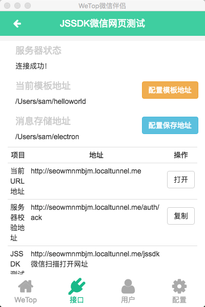
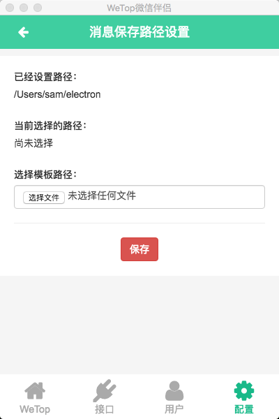
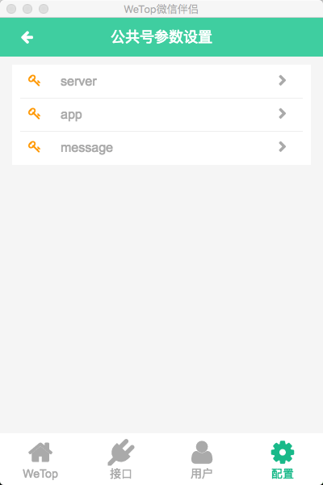
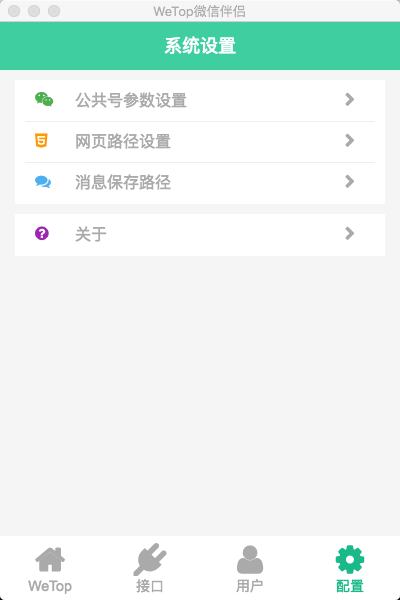
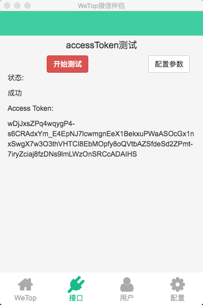
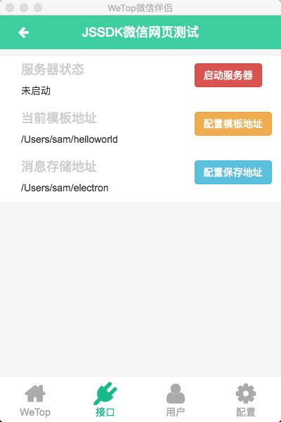
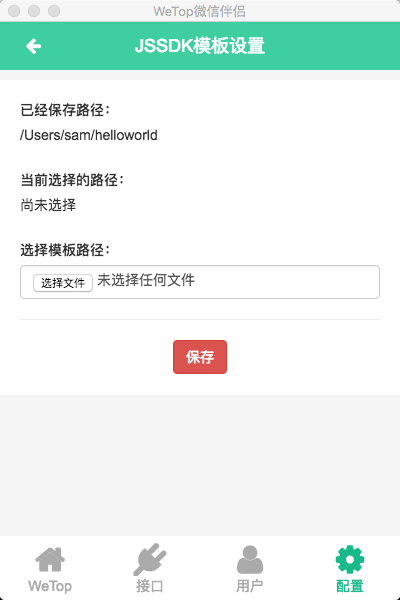

# node-weixin-desktop 
[![NPM version][npm-image]][npm-url] [![Build Status][travis-image]][travis-url] [![Dependency Status][daviddm-image]][daviddm-url] [![Coverage percentage][coveralls-image]][coveralls-url]

> WeTop微信伴侣

## 下载地址

[https://yun.baidu.com/s/1nuBpOBR](https://yun.baidu.com/s/1nuBpOBR)

## 编译

```sh
$ sh sh/all.sh
```

## 图片










## License

Apache v2.0 © [node-weixin](blog.3gcnbeta.com)


[npm-image]: https://badge.fury.io/js/node-weixin-desktop.svg
[npm-url]: https://npmjs.org/package/node-weixin-desktop
[travis-image]: https://travis-ci.org/node-weixin/node-weixin-desktop.svg?branch=master
[travis-url]: https://travis-ci.org/node-weixin/node-weixin-desktop
[daviddm-image]: https://david-dm.org/node-weixin/node-weixin-desktop.svg?theme=shields.io
[daviddm-url]: https://david-dm.org/node-weixin/node-weixin-desktop
[coveralls-image]: https://coveralls.io/repos/node-weixin/node-weixin-desktop/badge.svg
[coveralls-url]: https://coveralls.io/r/node-weixin/node-weixin-desktop
